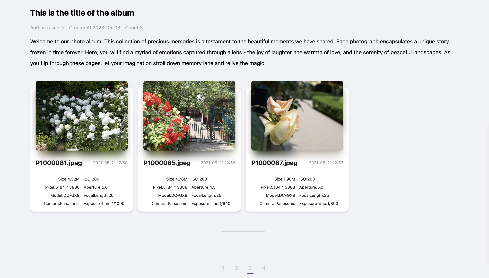

# PhotoAlbum V0.0.1

A web album compilation designed specifically for photographers. Specify a directory, recursively and concurrently retrieve all albums and paginate accordingly. Generate a cover when necessary.

除了看见照片，不然我已经回忆不了当时的情景。和音符一样，只有某个旋律，才能唤醒沉寂的回忆，让时间的细节再次绽放。

## 使用
这是一个根据本地文件夹（PhotoAlbums）和配置自动生成相册的软件，你只需要在文件夹下规划好你的子相册目录，并同时添加相应的配置，运行软件即可呈现web相册。
